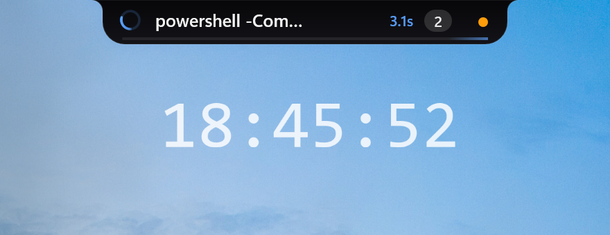
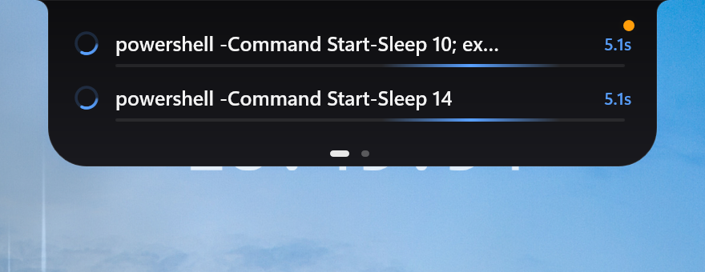
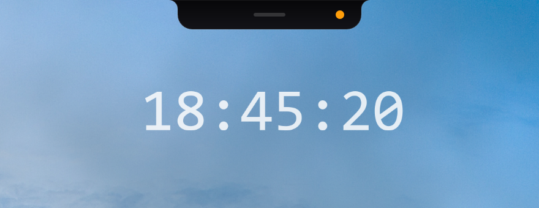
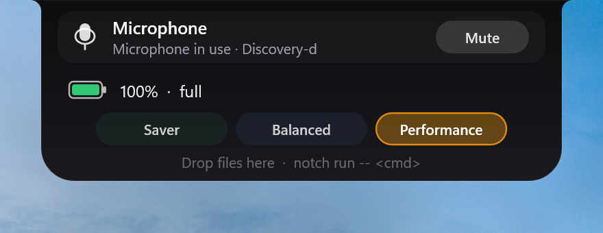
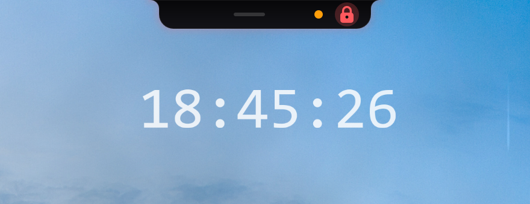
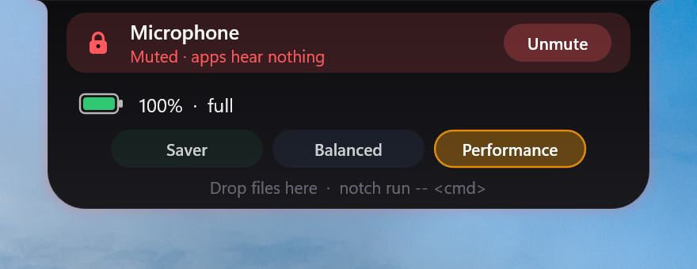

# Hytte

**A smart little notch for the top of your Windows 11 screen.**

Hytte puts a small pill at the top-centre of your screen. It stays quiet until something worth knowing happens: a build finishes, an AI agent needs your answer, a dev server starts, music plays, or you drag a file toward the top of the screen. Then it opens, shows you what matters, and tucks itself away again.

It never steals focus from what you're typing, and it uses almost no CPU while idle.

<p align="center">
  <br>
  
</p>

## What it can do

- **Watch long commands.** See when a build, test run or download finishes, and whether it failed, without staring at the terminal.
- **Tell you when an AI agent is waiting.** Claude Code, Aider and similar tools can ping the pill. It turns amber, and one click takes you to the right terminal.
- **Show your dev servers.** Anything listening on `localhost:3000`, `5173`, `8080` and friends shows up with **Open** and **Kill** buttons.
- **Hold files for you (the shelf).** Drag files or text onto the pill, switch windows or desktops, then drag them back out wherever you need them.
- **Quick file actions.** Shrink an image under 5 MB, turn it into a PDF, strip its location data, copy the text out of it, or tidy up JSON. One click each.
- **Control music.** See what's playing and skip or pause.
- **Mute every microphone at once**, with a red lock on the pill so you always know.
- **Timer and focus sessions.** Right-click the pill to start a countdown or a Pomodoro.
- **Battery and power mode** on laptops.
- **Camera and mic dots** that tell you when an app is using them.
- **Gets out of the way of games and videos**, shrinking to a hairline when something is fullscreen.

## Install

You need **Windows 11 (22H2 or newer, 64-bit)**.

1. Download the latest `hytte-<version>-x64.zip` from the [Releases](../../releases) page.
2. Unzip it somewhere permanent, for example `C:\Tools\Hytte`.
3. Run `hytte.exe`. The pill appears at the top of your screen and an icon appears in the system tray. Hytte also adds its folder to your `PATH`, so the `notch` command works in any terminal you open from now on.
4. Right-click the tray icon and choose **Set up terminal integration**. This makes your terminal report long-running commands to the pill (see [Track every command automatically](#track-every-command-automatically)).

To start Hytte automatically, right-click the tray icon and tick **Launch at startup**.

<details>
<summary>Build it yourself instead</summary>

Install [Rust](https://rustup.rs), then:

```powershell
git clone <this repo>
cd hytte
cargo build --release --workspace
```

`hytte.exe` and `notch.exe` end up in `target\release\`.
</details>

The zip contains two programs:

| Program | What it is |
|---|---|
| `hytte.exe` | The app itself, the pill and the tray icon. |
| `notch.exe` | A small command you use from terminals and scripts to talk to the pill. |

## A five-minute tour

**1. Hover the pill.** Rest your mouse on it and it opens. Move away and it closes. Scroll over it to flip between panels, or click the dots along the bottom.

**2. Track a slow command.** Put `notch run --` in front of anything:

```powershell
notch run -- npm run build
```

You'll see a spinner and a timer, then a green tick or a red cross. On failure, the last error lines appear with a **Copy error** button. Your command runs exactly as before; if Hytte isn't running, nothing changes.

**3. Track every slow command automatically.** Add one line to your shell (see [below](#track-every-command-automatically)). Anything that runs longer than 3 seconds then shows up without the `notch run` prefix.

**4. Park a file.** Drag a file toward the top of the screen and drop it on the pill. Later, drag it back out of the pill into Explorer, an email or a chat window. Click a file on the shelf to see what you can do with it.

**5. Start a timer.** Right-click the pill, scroll to pick the minutes, then press **Timer** or **Focus**.

## What the pill is telling you

| You see | It means |
|---|---|
| A small dark capsule | Nothing is happening. |
| A spinner and a timer | A task is running. |
| A green tick | A task finished fine. It disappears after a few seconds. |
| A red cross | A task failed. It stays until you dismiss it. |
| An amber glow and a bell | Something (usually an AI agent) is waiting for you. Click it. |
| `● :3000` | A dev server is running on that port. |
| A stacked-tiles icon with a number | Files are waiting on your shelf. |
| Album art and moving bars | Music is playing. |
| A red lock | Your microphones are muted. |
| A green or orange dot | An app is using your camera (green) or microphone (orange). |
| A thin grey line | Something is fullscreen; hover it to bring the pill back. |

| Idle | Home card | Muted | Muted, opened |
|---|---|---|---|
|  |  |  |  |

**Clicking things:**
- Click a task to jump to the terminal it's running in. In Windows Terminal, the right tab is selected too.
- Click the album art to bring the music app to the front.
- **Kill** on a port asks once ("Kill?"); click again within 3 seconds to confirm.
- Hytte never takes keyboard focus away from what you're doing.

**Tray icon (right-click):** **Pause** hides the pill, **Launch at startup**, **Set up terminal integration**, **Open settings folder**, **Quit**.

## Common setups

### Track every command automatically

The easy way: right-click the tray icon and choose **Set up terminal integration**, or run `notch setup`. Then open a new terminal. This adds the line to your PowerShell (5.1 and 7) and Git Bash profiles. Choosing it again, or running `notch setup --undo`, removes the line.

To do it by hand, or for zsh and Nushell, add the line for your shell, then open a new terminal:

| Shell | Add this line | To this file |
|---|---|---|
| PowerShell | `notch init pwsh \| Out-String \| Invoke-Expression` | `$PROFILE` |
| bash / Git Bash | `eval "$(notch init bash)"` | `~/.bashrc` |
| zsh | `eval "$(notch init zsh)"` | `~/.zshrc` |
| Nushell | run `notch init nu \| save -f ~/.config/nushell/notch.nu`, then add `source ~/.config/nushell/notch.nu` | `config.nu` |

Using Starship? In bash, put the line *before* the `starship init` line. In PowerShell, put it *after*. `notch setup` does this for you.

If Windows PowerShell says running scripts is disabled, run `Set-ExecutionPolicy -Scope CurrentUser RemoteSigned` once.

Commands under 3 seconds never show up, and editors and pagers such as `vim`, `less` and `ssh` are ignored, so the pill doesn't flicker.

### Get pinged when Claude Code needs you

```powershell
notch agent hooks claude
```

This prints a block of settings. Paste it into your Claude Code `settings.json`. From then on, the pill turns amber whenever Claude is waiting for you.

For other tools, have them run `notch agent needs-input --name "MyTool" --message "waiting for you"` when they need you, and `notch agent done --name "MyTool"` when they finish.

### Report progress from a script

```powershell
notch set --progress 40 --label "Uploading" --task upload-1
```

Use the same `--task` name each time to update one entry.

### Ports from the terminal

```powershell
notch ports            # list dev servers
notch kill :3000       # stop whatever is on port 3000 (asks first)
```

## Settings

Settings live in `%APPDATA%\Hytte\config.toml` (tray menu → **Open settings folder**). The file is created on first run, and every setting is optional. Changes apply as soon as you save the file; if it has a mistake, Hytte keeps the previous settings until it reads correctly again.

The ones people change most:

```toml
[general]
autostart = false              # start with Windows
fullscreen_mode = "sentinel"   # "sentinel" = thin line, "hide" = disappear completely
allow_list = []                # apps that never make Hytte back off, e.g. ["Code.exe"]
deny_list = []                 # apps that always hide Hytte, e.g. ["game.exe"]
output_folder = "D:\\Hytte"    # where file actions save results (default: next to the file)

[shell]
threshold_ms = 3000            # how long a command must run before it shows
ignore = ["vim", "nvim", "ssh", "less", "man", "top", "htop", "tmux", "fzf"]

[shelf]
mode = "reference"             # "reference" points at your file, "copy" keeps its own copy
max_items = 12

[ports]
watch = [3000, 3001, 4200, 5000, 5173, 5432, 8000, 8080, 8888]
show_all = false               # true = show every server, not just the ports above

[agent]
sound = false                  # beep when an agent needs you

[timer]
sound = true                   # chime when a timer ends
```

The full list of settings is in [the configuration guide](docs/11-configuration-and-files.md).

## Troubleshooting

| Problem | Try this |
|---|---|
| "another instance is running" | Hytte is already running. Look for it in the tray. |
| I can't see the pill | Something may be fullscreen (look for a thin grey line), or Hytte is paused (tray menu). |
| `notch: daemon not running` | Start `hytte.exe`. Your command still ran. |
| `notch` isn't recognised | Open a **new** terminal window: terminals that were already open don't see the updated `PATH`. Or run `notch setup` from the Hytte folder (`.\notch.exe setup`). |
| Shell commands don't show up | Use **Set up terminal integration** in the tray, then open a new terminal. Commands under 3 seconds are hidden on purpose. |
| A port isn't listed | Add it to `[ports] watch`, or set `show_all = true`. |
| "OCR unavailable" | Install a language pack with text recognition in *Settings → Time & language → Language & region*. |
| No music controls | The music app has to report itself to Windows (most browsers and players do). |

Logs are written to `%APPDATA%\Hytte\hytte.log`.

## Good to know

- Only the **primary monitor** is supported for now.
- Hytte can't draw over games running in **exclusive fullscreen**; it backs off instead.
- Images dragged straight from a **browser** aren't supported yet. Save the image first.
- The binaries aren't signed yet, so Windows SmartScreen may warn you the first time.

## For developers

Want to know how Hytte works or contribute? Start with the [developer documentation](docs/README.md). It walks through the architecture, every subsystem, and how to add features.

## License

MIT.
